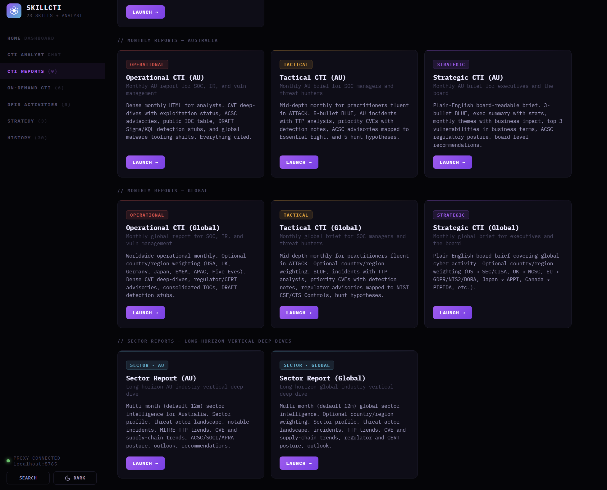

# CTI & DFIR Skills for Claude Code

A collection of **Cyber Threat Intelligence (CTI)** and **Digital Forensics and Incident Response (DFIR)** skills for [Claude Code](https://claude.com/claude-code), plus a self-hosted browser launcher called **SkillCTI** with a built-in CTI Analyst chat, a daily-news dashboard, and a project-ready PDF export pipeline.

Each skill turns a common analyst workflow — profiling an actor, enriching IOCs, building a threat model, drafting detections, running a tabletop, publishing a monthly report, investigating a phishing email, building YARA, exporting STIX, generating an ATT&CK Navigator layer, reconstructing an incident timeline — into a single command that produces a polished, client-deliverable HTML or PDF.

All HTML reports use a refined editorial dark theme (Bloomberg / Mandiant aesthetic). PDF mode switches to a print-ready light theme converted server-side via headless Edge. Every claim is cited; in-text citations are clickable anchors to the references list, and reference URLs link to the original article. Detection content is marked **DRAFT**.



## Two ways to use these skills

**A. Claude Code slash commands.** Install the skill folders into `~/.claude/skills/` and invoke any skill from a Claude Code session with `/<skill-name>`.

**B. SkillCTI (browser launcher).** A single-page app in `skill-cti/` that exposes every CTI skill as a click-to-run card, plus a free-form CTI Analyst chat, a daily-news dashboard, Cmd+K command palette, theme toggle, present mode, and persistent history with filtering and sorting. Reports auto-save to a local `reports/` directory and can be exported as real vector PDFs via headless Edge.

Both paths use the same underlying skill prompts.

---

## Installation — Claude Code slash commands

1. Clone or download this repository.
2. Copy the skill folders into your Claude Code skills directory:
   - **macOS / Linux:** `~/.claude/skills/`
   - **Windows:** `%USERPROFILE%\.claude\skills\`
3. Restart Claude Code (or open a new session). Each folder name becomes a slash command — e.g. `/cti-stix-export`.

You can also drop individual skills in if you only want a subset.

Invoke any skill by typing `/<skill-name>` followed by the argument it expects. Most accept a URL, a file path, or pasted content.

```
/threat-actor-profile https://example.com/scattered-spider-report
/cti-monthly-report-strategic-australia 2026-04
/cti-daily-brief-global
/cti-stix-export https://www.mandiant.com/resources/blog/apt29-wineloader
/cti-attack-navigator APT29
```

## Installation — SkillCTI

**Prerequisites:** Python 3.10+ and either Microsoft Edge (default on Windows 10/11) or Google Chrome installed somewhere standard. Edge/Chrome is used for headless HTML → PDF conversion. No Python packages need installing — the proxy uses only the standard library.

1. Set your Anthropic API key in the shell that will run the proxy:
   ```
   export ANTHROPIC_API_KEY=sk-ant-...
   ```
   (Windows PowerShell: `$env:ANTHROPIC_API_KEY = "sk-ant-..."`.)

2. Start the local proxy. It keeps the API key out of the browser, persists generated reports to disk, and handles headless-browser PDF conversion:
   ```
   cd skill-cti
   python proxy.py
   ```
   You should see a banner listing the API key (masked), the reports directory, the detected browser path for PDF conversion, and the listening port `localhost:8765`.

3. Open `skill-cti/skill-cti.html` in any modern browser.

Generated reports are auto-saved to `skill-cti/reports/` as a paired `<id>.html` (or `<id>.pdf`) and `<id>.meta.json`, and surface in the History tab.

---

## SkillCTI features

The launcher is a single-file dark-themed HTML app with a left sidebar nav and per-tab content.

### Home dashboard (default landing tab)

A 2×2 widget grid:

- **Recent Reports** — the 8 most recent saved reports. Each row shows the skill badge, derived title, and relative time. Click to re-open (HTML in modal, PDF in a new tab). Auto-refreshes whenever a new report is generated.
- **Daily Cyber News** — top 4 cybersecurity stories from the last 24 hours sourced via web_search across BleepingComputer, The Record, Krebs, Reuters/Bloomberg cyber, CISA/NCSC/ACSC, vendor threat intel and leak-site trackers. Every headline links to the original article. Cached for the day in localStorage (one API call per day) with a manual refresh button.
- **AU Ransomware Victims** — last 3-5 named Australian victims from ransomware.live, fetched server-side via the proxy's `/ransomware-au` passthrough (calls the public `https://api.ransomware.live/v2/countryvictims/au` endpoint, no API key required). 6-hour cache. Falls back to a friendly placeholder if the upstream API is unreachable.
- **Quick Ask Analyst** — type a CTI question and press Enter; the dashboard switches to the CTI Analyst tab and sends the question automatically.

### CTI Analyst — chat

A free-form chat with a CTI Support Analyst persona. Use it when you don't know which skill applies, want a quick intel answer, or want a recommendation.

- Answers quick factual questions directly using web_search and cites sources.
- **Recommends and pre-fills the right skill** when your question maps to a structured deliverable. The reply ends with a launch card containing a `LAUNCH →` button that opens the skill's input drawer with fields already populated from your question.
- Multi-turn context — full chat history is sent each turn so follow-ups like *"now do the same for the energy sector"* work naturally.
- Chat is session-only; refresh the page to clear it.

### CTI Reports (9)

Long-form scheduled and sector reports. Three subsections:
- **Monthly Reports — Australia** (3): operational, tactical, strategic
- **Monthly Reports — Global** (3): operational, tactical, strategic (optional country/region weighting)
- **Sector Reports** (2): AU and global long-horizon vertical deep-dives
- **Daily Briefings** (1): one-page global cyber news brief for the morning commute

### On-Demand CTI (6)

Single-event, ad-hoc, or investigation-driven outputs:
- **Security Advisory** — exec briefing on a breach, CVE, or cyber event
- **Threat Actor Profile** — structured actor profile from URL or report
- **IOC Enrichment** *(launcher only for now — slash-command version in development)* — IR-grade enrichment for IPs, domains, URLs, hashes, with mandatory WHOIS
- **Admiralty Assessment** — grade an intel report against the NATO Admiralty Code (6×6)
- **STIX Bundle Export** — extract IOCs and emit STIX 2.1 JSON for MISP / OpenCTI / Sentinel TI
- **ATT&CK Navigator Layer** — render the ATT&CK matrix inline AND emit a Navigator JSON layer

### DFIR Activities (5)

Investigation, detection engineering, and event-data workflows:
- **Log Analysis (Sherlog Holmes)** — standalone interactive log triage dashboard (opens in a new tab)
- **Phishing DFIR** — forensic analysis of a single suspicious email
- **Detection as Code** — Sigma + KQL detection pack from threat intel
- **YARA Rule Generator** — DRAFT YARA rules from a report or malware description
- **Incident Timeline** — chronological UTC + Melbourne local timeline from raw events

### Strategy (3)

Long-form strategic deliverables — program design, threat modelling, and crisis preparation:
- **Mythos-Ready Assessment** — strategic recommendation report aligned to the CSA / SANS / OWASP "Mythos-Ready Security Program" framework
- **Threat Model (PASTA)** — seven-stage threat model from a system or architecture description
- **Tabletop Exercise** — facilitator-ready IR TTX from threat intel

### History

Every report generated through the launcher is auto-saved to `skill-cti/reports/`. The History tab lists them newest-first with badge, derived title, timestamp, file size, and format (HTML or PDF).

**Filter + sort controls** at the top of the tab:
- Free-text search across title, skill name, badge
- Category filter — All / Daily briefs / Monthly reports / Sector reports / On-demand CTI / DFIR activities / Imported / Other
- Format filter — HTML + PDF / HTML only / PDF only
- Sort — Newest / Oldest / Title A→Z / Title Z→A / Largest / Smallest

Click **OPEN** to re-render any saved report (HTML → modal viewer, PDF → new browser tab). Click **DELETE** to remove the report from disk.

**Drop hand-imported HTML reports** into `skill-cti/reports/` and the proxy auto-adopts orphan `.html` files on the next list refresh, using the filename as the title and the file mtime as the timestamp. Imported reports get a grey `IMPORTED` badge to distinguish them.

### Cmd+K command palette

Press **Cmd+K** (Mac) or **Ctrl+K** (Windows), or click the **SEARCH** button in the sidebar footer. Fuzzy-search every tab, every skill, every saved report, plus actions (toggle theme, refresh history). Keyboard nav: ↑/↓ to move, Enter to activate, Esc to close.

### Theme toggle

Sidebar footer button toggles between dark (default) and light themes for the launcher chrome. Stored per-browser in localStorage.

### Present mode

Every generated HTML report includes a **▶ PRESENT** button in the top-right of the report. Clicking it puts the report into a fullscreen, larger-typography projection-ready view suitable for in-meeting screen sharing. Esc exits.

The launcher's output modal also has a **▶ PRESENT** button — for older reports without their own button baked in, the launcher injects the presentation styling into the iframe on the fly.

### PDF mode

When you generate a report in the drawer with format set to **PDF**, the flow is:

1. The model produces a print-ready HTML document (light theme, A4, sans-serif, no fixed-position elements, no JavaScript)
2. The browser ships the HTML to the proxy's `/generate-pdf` endpoint
3. The proxy runs headless Edge (or Chrome) via `--print-to-pdf` to convert the HTML to a real vector PDF
4. The PDF is saved to `skill-cti/reports/<id>.pdf` and streamed back to the browser as an automatic download
5. The PDF appears in the History tab with a `PDF` badge

The result is a true vector PDF (selectable text, crisp at any zoom, true A4 page size) — not a rasterised screenshot.

### Clickable citations

Every report — HTML and PDF — uses a global citation-formatting rule that:
- Makes every in-text `[n]` superscript a clickable anchor jumping to the corresponding reference entry
- Makes every reference URL a clickable link opening the source article in a new tab

Works identically in the on-screen HTML view and in the converted PDF (Chromium preserves internal anchors and external links in PDF export).

---

## Skill reference

The skills below are grouped to mirror the launcher's tabs. Every skill is invokable from Claude Code as `/<skill-name>`.

## CTI Reports

### Daily Briefings (one)

#### `cti-daily-brief-global`

One-page global cybersecurity news brief covering the last 24 hours, optimised for a 3-5 minute morning-commute read. Sections: 3-bullet TLDR, 4-6 top stories with one-line summaries and source citations, CVE Watch with exploitation status, Ransomware Watch for newly-named victims, What-to-Watch for the next 24-48 hours. Pulls from BleepingComputer, The Record, Krebs, Reuters/Bloomberg cyber, CISA/NCSC/ACSC/BSI/ANSSI/JPCERT/ENISA, vendor threat intel, and ransomware leak-site trackers.

```
/cti-daily-brief-global [YYYY-MM-DD]
```

### Monthly reports (six)

Six skills produce recurring CTI deliverables for the past 30 days. They differ along two axes:

- **Audience tier** — strategic (executive / board), tactical (SOC manager / threat hunter), or operational (SOC analyst / IR / vuln management).
- **Geography** — Australia-focused, or global with optional country/region weighting (USA, UK, Germany, Japan, Europe, EMEA, APAC, Five Eyes, etc.).

All six accept an optional `[YYYY-MM]` argument. The global variants additionally accept `[country|region]`.

#### `cti-monthly-report-strategic-australia`

Plain-English board brief for executives, CISOs, and directors. 3-bullet BLUF, by-the-numbers stats, monthly themes with business impact, top 3 vulnerabilities in business terms, ACSC regulatory posture, global trends affecting Australia, board-level recommendations.

```
/cti-monthly-report-strategic-australia [YYYY-MM]
```

#### `cti-monthly-report-strategic-global`

Same audience and shape as the AU strategic brief, but global — with regulator framing tuned to the supplied country/region (GDPR, NIS2, DORA, CIRCIA, HIPAA, SEC cyber rules, PIPEDA, APPI, NCSC-UK, etc.).

```
/cti-monthly-report-strategic-global [country|region] [YYYY-MM]
```

#### `cti-monthly-report-tactical-australia`

Mid-depth report for SOC managers, threat hunters, and security architects. 5-bullet BLUF, Australian incidents with TTP analysis, 5-10 priority CVEs with detection notes, ACSC advisories mapped to Essential Eight and NIST CSF, global actor activity, 5 hunt hypotheses for the coming month. MITRE ATT&CK references throughout.

```
/cti-monthly-report-tactical-australia [YYYY-MM]
```

#### `cti-monthly-report-tactical-global`

Tactical report at global scope. Maps to NIST CSF and (region-appropriate) Essential Eight or CIS Controls; pulls advisories from CISA, NCSC-UK, BSI, ANSSI, CCCS, JPCERT, ENISA, etc.

```
/cti-monthly-report-tactical-global [country|region] [YYYY-MM]
```

#### `cti-monthly-report-operational-australia`

Long, dense analyst-grade roundup. 5-bullet BLUF with CVE IDs, Australian incidents with public IOCs and IR timelines, full CVE deep-dive table with patching priorities, every ACSC advisory with affected versions, consolidated IOCs (IPs / domains / hashes), DRAFT Sigma/KQL detection stubs, global tooling and malware shifts.

```
/cti-monthly-report-operational-australia [YYYY-MM]
```

#### `cti-monthly-report-operational-global`

Operational roundup at global scope.

```
/cti-monthly-report-operational-global [country|region] [YYYY-MM]
```

### Sector reports (long-horizon)

Two skills produce long-horizon CTI reports for a single industry **sector** rather than a calendar month. They synthesise a multi-month horizon (default 12 months) and look for trends, threat-actor targeting patterns, and a forward-looking outlook.

#### `cti-sector-report-australia`

Sector deep-dive for an Australian audience. Maps the chosen sector to its SOCI Act categorisation and weaves SOCI positive security obligations, risk-management programs, and mandatory cyber-incident reporting through the recommendations. Pulls from ACSC, ASD, OAIC, CISC, and the lead sector regulator.

```
/cti-sector-report-australia <sector> [horizon]
```

Examples: `/cti-sector-report-australia healthcare`, `/cti-sector-report-australia "food and grocery" 2y`.

#### `cti-sector-report-global`

Same shape, global scope, with optional country/region weighting. Regulatory framing switches to the appropriate regime (NIS2 / DORA, HIPAA / SEC / NYDFS / NERC CIP, FCA / PRA, BaFin, MAS TRM, OSFI, etc.). Sector ISAC sources pulled in.

```
/cti-sector-report-global <sector> [country|region] [horizon]
```

---

## On-Demand CTI

Single-event, ad-hoc, or investigation-driven outputs.

### `cti-security-advisory`

Short, decision-oriented executive briefing for a single newsworthy event — a major breach, a zero-day, an actively-exploited CVE, a supply-chain compromise, a high-profile ransomware incident, or a regulatory action. One to two pages of plain-English HTML for a CEO / CFO / GC / board member / peer CISO. Structured around **decisions**, not analysis.

```
/cti-security-advisory <URL, CVE ID, or event name> [country|region]
```

### `threat-actor-profile`

Structured threat actor profile from a URL or attached document. BLUF, actor metadata, Diamond Model overlay, MITRE ATT&CK TTPs, IOCs, targeted sectors and geographies, SOCI Act relevance, recommended detections.

```
/threat-actor-profile <URL or filename>
```

### `cti-ioc-enrich` — in development

Fast-turn IOC enrichment for incident response — IPv4/IPv6, domains, URLs, and file hashes, with mandatory WHOIS plus VirusTotal, AbuseIPDB, urlscan.io, Spur, Shodan, GreyNoise, Talos, MalwareBazaar, and public sandbox lookups.

**Available today** via the SkillCTI launcher (On-Demand CTI tab → IOC Enrichment). The standalone slash-command version is in active development and will return in a future release — track the issue tracker or the repo CHANGELOG for the ship date.

### `cti-admiralty-assessment`

Quality-assesses a CTI report using the NATO Admiralty Code (6×6). Extracts each major claim, identifies cited source, grades source reliability A–F and information credibility 1–6, flags single-sourced or unverifiable claims, gives an overall report grade with recommendations to strengthen tradecraft.

```
/cti-admiralty-assessment <URL or pasted report>
```

### `cti-stix-export`

Extracts every IOC from a threat intel source (URL, pasted report, or IOC list) and emits a valid STIX 2.1 JSON bundle ready for import into MISP, OpenCTI, Anomali ThreatStream, Microsoft Sentinel TI, ThreatConnect, ThreatQuotient, Recorded Future, IBM SIRP, or EclecticIQ. Builds proper STIX SDOs (indicator, threat-actor, intrusion-set, malware, campaign, identity, marking-definition) and SROs (relationship) with valid STIX patterns and TLP markings. Output is a dark-themed HTML viewer wrapping the bundle, with a one-click `.json` download.

```
/cti-stix-export <URL or pasted report>
```

### `cti-attack-navigator`

Extracts MITRE ATT&CK techniques from a threat report, actor profile, or TTP list and **(1)** renders a visual ATT&CK matrix inline in the HTML report — tactic columns with colour-coded technique cells per score — so you see the heatmap immediately, and **(2)** also emits a valid Navigator JSON layer file you can download and upload to attack-navigator.mitre.org for the full official matrix view, gap analysis, and stack comparison.

```
/cti-attack-navigator <URL · actor name · TTP list>
```

---

## DFIR Activities

Investigation, detection engineering, and exercise-prep workflows.

### `log-analysis` — Sherlog Holmes dashboard

Standalone interactive log-triage dashboard. Unlike the slash-command skills, this is a self-contained browser app with its own proxy. Lives in `log-analysis/`. Supports multi-file log upload, severity filtering, source filtering, IP correlation across files, AI-assisted summarisation.

**Launch:** click the *Log Analysis* card in the SkillCTI **DFIR Activities** tab to open in a new tab, or open `log-analysis/siem-dashboard.html` directly with `python log-analysis/proxy.py` running.

### `dfir-phishing-analysis`

Full DFIR analysis of a single suspicious or confirmed phishing email. Accepts `.eml`, `.msg`, pasted headers + body, screenshot, or URL to a published phishing report. Performs full header analysis (SPF / DKIM / DMARC), sender infrastructure enrichment with lookalike-domain detection, URL redirect-chain unrolling, attachment hashing with sandbox lookup, lure / brand-impersonation analysis, phishing-kit / PhaaS identification (EvilProxy / Tycoon 2FA / Mamba2FA / etc.), campaign attribution, victim-impact assessment, banded containment actions, region-aware abuse reporting (ACSC / IC3 / NCSC / national CERT), and DRAFT Sigma / KQL detection stubs.

```
/dfir-phishing-analysis <.eml file, pasted headers/body, screenshot, or URL> [country|region]
```

### `cti-detection-as-code`

Converts a threat actor profile, threat report, or TTP list into reviewable detection content — Sigma rules (SigmaHQ-spec YAML) and Microsoft Sentinel / Defender KQL — tagged with technique IDs and traced back to source.

```
/cti-detection-as-code <URL, filename, or comma-separated TTPs>
```

### `cti-yara-generator`

DRAFT YARA rules from a malware family description, threat intel report, or sample analysis. Each rule has a full meta block (description, author, date, version, reference, malware_family, mitre_attack, severity, confidence, status DRAFT, tlp), distinctive ASCII / Unicode / hex strings, robust conditions using file-type pre-filters, count thresholds, and the `pe` module where appropriate. Produces multiple narrow-focus rules per family (strings rule, bytes / opcodes rule, PE structure rule, behavioural rule, config rule) rather than one over-broad rule. Output is an HTML viewer with one card per rule, full source in copy-on-click code blocks, false-positive notes, tuning guidance, MITRE tags, and a one-click download of the combined `.yar` file.

```
/cti-yara-generator <URL · report · malware analysis> [family name]
```

### `dfir-incident-timeline`

Consolidates raw events (paste logs, IR notes, CSV slices, SIEM exports) into a chronological incident timeline. Every event shown in **TWO** timestamp columns: **UTC** and **Melbourne local time** (AEST UTC+10 / AEDT UTC+11, DST-aware — first Sunday in October jumps forward, first Sunday in April falls back). Each event classified into MITRE-aligned phases, tagged with confidence (high/medium/low), flagged with anomaly callouts (out-of-hours uses Melbourne local, geographically unusual, defender-bypass, first-of-kind). Includes dwell-time calculation, gap analysis showing tactics with no observed events plus hunt-hypothesis suggestions, a visual swimlane, and a downloadable CSV.

```
/dfir-incident-timeline <raw events — paste, file path, or csv> [incident name] [time-zero anchor]
```

---

## Strategy

Long-form strategic deliverables — program design, architectural risk, and crisis preparation. The skills below mirror the launcher's **Strategy** tab.

### `cti-mythos-ready-assessment`

Produces a client-deliverable strategic recommendation report based on the CSA / SANS / OWASP **"Mythos-Ready Security Program"** framework (the industry response to Anthropic's Claude Mythos autonomous-offensive capabilities — 181 Firefox 0-days, 72% exploit success rate, end-to-end 32-step attack chains, sub-$2k exploit cost floor).

Assesses an organisation against the 5 Mythos-Ready pillars (AI-driven defensive capabilities, accelerated VulnOps, hardened core controls, updated risk models, cross-industry coordination) and the 5 operational steps (continuous deterministic asset discovery, ruthless risk filtering, attack path analysis, adversarial exposure validation, agentic remediation governance). Maps gaps to NIST CSF 2.0, CCM v4, ISO/IEC 27001:2022, NIST AI RMF, and region-specific obligations (Essential Eight + SOCI for AU; CIRCIA + SEC for US; NIS2 + DORA + EU AI Act; NCSC CAF for UK). Outputs a phased 30 / 90 / 180 / 365-day uplift roadmap with quick wins, investment priorities, tooling categories, FTE estimates, framework mapping table, and board-level talking points.

**Use when:** a CISO / CIO / board needs a defensible strategic plan for AI-accelerated vulnerability discovery, or a consulting team needs a client-ready Mythos-readiness assessment to drive a budget discussion.

**Invoke:**
```
/cti-mythos-ready-assessment <organisation context — sector, size, current maturity, key concerns> [region]
```

Examples:
- `/cti-mythos-ready-assessment "ASX-listed financial services, ~3,000 staff, Essential Eight ML2, hybrid Azure + on-prem" AU`
- `/cti-mythos-ready-assessment "US mid-market healthcare, 800 staff, NIST CSF managed, all-cloud" US`

**Output:** a 10-12 page HTML report with executive summary, current-state gap analysis, pillar-by-pillar recommendations, identity hardening roadmap, phased 30/90/180/365-day timeline, investment profile with FTE estimates, governance and board talking points, framework mapping table, and a UK AISI "stronger execution of basics" anchor that keeps the report grounded.

### `cti-threat-model`

PASTA threat model from a PDF or URL describing an application, system, or architecture. Walks all seven PASTA stages — Define Objectives, Define Technical Scope, Application Decomposition, Threat Analysis, Vulnerability and Weakness Analysis, Attack Modeling, Risk and Impact Analysis. Output includes inline SVG data flow diagram, MITRE ATT&CK / CAPEC mappings, attack trees, risk register heat map, prioritised controls mapped to ASD Essential Eight and ISM, and Australian regulatory context (SOCI Act, OAIC, APRA CPS 234).

```
/cti-threat-model <URL or filename>
```

### `cti-tabletop`

Facilitator-ready IR Tabletop Exercise from a threat intel input. Six phased injects: initial detection, triage and escalation, containment decision, eradication and investigation, recovery and communications, and hot-wash. Australian regulatory triggers baked in (ACSC, SOCI Act, OAIC NDB, APRA CPS 234).

```
/cti-tabletop <URL or filename> [duration e.g. 2h]
```

---

## Skill catalogue at a glance

| Tab | Skill | Slash command |
| --- | --- | --- |
| CTI Reports | Daily Brief (Global) | `/cti-daily-brief-global` |
| CTI Reports | Strategic AU monthly | `/cti-monthly-report-strategic-australia` |
| CTI Reports | Strategic global monthly | `/cti-monthly-report-strategic-global` |
| CTI Reports | Tactical AU monthly | `/cti-monthly-report-tactical-australia` |
| CTI Reports | Tactical global monthly | `/cti-monthly-report-tactical-global` |
| CTI Reports | Operational AU monthly | `/cti-monthly-report-operational-australia` |
| CTI Reports | Operational global monthly | `/cti-monthly-report-operational-global` |
| CTI Reports | AU sector deep-dive | `/cti-sector-report-australia` |
| CTI Reports | Global sector deep-dive | `/cti-sector-report-global` |
| On-Demand CTI | Security Advisory | `/cti-security-advisory` |
| On-Demand CTI | Threat Actor Profile | `/threat-actor-profile` |
| On-Demand CTI | Admiralty Assessment | `/cti-admiralty-assessment` |
| On-Demand CTI | STIX Bundle Export | `/cti-stix-export` |
| On-Demand CTI | ATT&CK Navigator Layer | `/cti-attack-navigator` |
| DFIR Activities | Log Analysis dashboard | *(open `log-analysis/siem-dashboard.html`)* |
| DFIR Activities | Phishing DFIR | `/dfir-phishing-analysis` |
| DFIR Activities | Detection as Code | `/cti-detection-as-code` |
| DFIR Activities | YARA Rule Generator | `/cti-yara-generator` |
| DFIR Activities | Incident Timeline | `/dfir-incident-timeline` |
| Strategy | Mythos-Ready Assessment | `/cti-mythos-ready-assessment` |
| Strategy | Threat Model (PASTA) | `/cti-threat-model` |
| Strategy | Tabletop Exercise | `/cti-tabletop` |

**23 skills total** — 22 slash commands plus the standalone Log Analysis dashboard. The launcher's CTI Analyst chat sits across all of them as a discoverability and routing layer.

---

## Repository layout

```
skills/
├── README.md
├── LICENSE
├── skill-cti/                      ← the browser launcher
│   ├── skill-cti.html              ← single-file UI (HTML + CSS + JS)
│   ├── skills.js                   ← skill catalogue + prompt overrides
│   ├── proxy.py                    ← local API proxy + PDF generator + history store
│   └── reports/                    ← auto-saved generated reports (HTML + PDF + .meta.json)
├── log-analysis/                   ← standalone Sherlog Holmes log dashboard
│   ├── siem-dashboard.html
│   └── proxy.py
├── cti-daily-brief-global/         ← each of these folders is a Claude Code slash command
├── cti-monthly-report-strategic-australia/
├── cti-monthly-report-strategic-global/
├── cti-monthly-report-tactical-australia/
├── cti-monthly-report-tactical-global/
├── cti-monthly-report-operational-australia/
├── cti-monthly-report-operational-global/
├── cti-sector-report-australia/
├── cti-sector-report-global/
├── cti-security-advisory/
├── threat-actor-profile/
├── cti-admiralty-assessment/
├── cti-stix-export/
├── cti-attack-navigator/
├── cti-mythos-ready-assessment/
├── dfir-phishing-analysis/
├── cti-detection-as-code/
├── cti-threat-model/
├── cti-tabletop/
├── cti-yara-generator/
└── dfir-incident-timeline/
```

Each slash-command folder contains a single `SKILL.md` file with frontmatter (`name`, `description`, `allowed-tools`, `argument-hint`) and a prompt body.

---

## Notes

- Every skill writes its output as a **single self-contained HTML file** — no external CSS, JS, or image dependencies. You can email, archive, or host the file as-is. PDF mode produces a real vector PDF via headless Edge / Chrome.
- All citations link back to the original source. If a claim can't be cited, it's flagged as an assumption. In-text `[n]` superscripts are clickable anchors to the references list; reference URLs are clickable links to the source.
- Detection content (Sigma, KQL, YARA) is **DRAFT**. Tune log sources, field names, and thresholds for your environment before deploying.
- Australian-flavoured skills assume an ANZ critical-infrastructure context (SOCI Act, ACSC, OAIC NDB, APRA CPS 234, ASD Essential Eight). Global variants swap in the appropriate regional frameworks.
- The **SkillCTI launcher** and the **slash commands** use the same skill prompts and produce the same outputs. The launcher adds a UI, persistent history with filter/sort, PDF export, Cmd+K command palette, theme toggle, present mode, dashboard widgets, and the CTI Analyst chat; the slash commands integrate with Claude Code's filesystem and IDE awareness.

## License

See `LICENSE` in the repository root.
